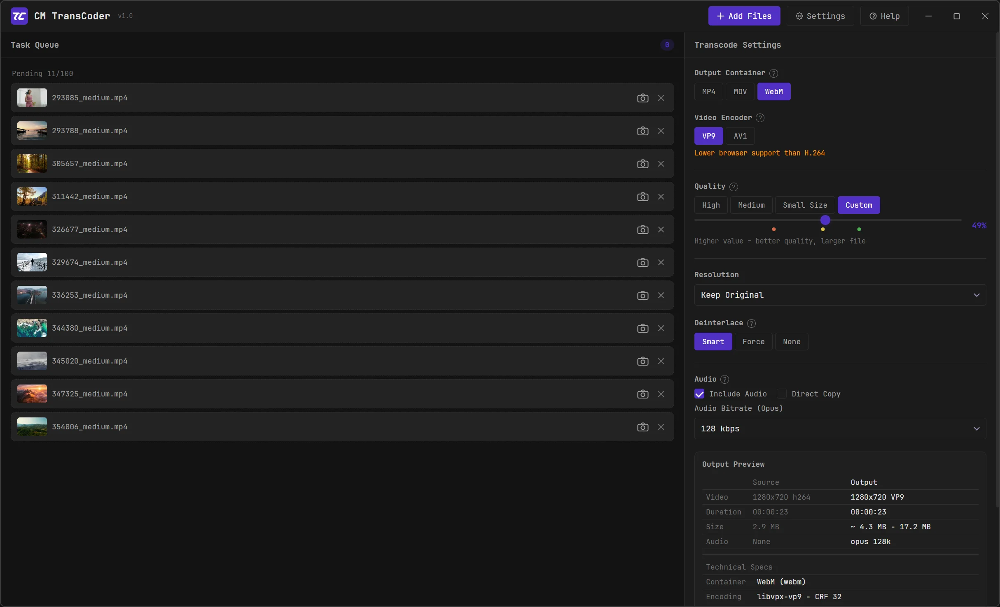
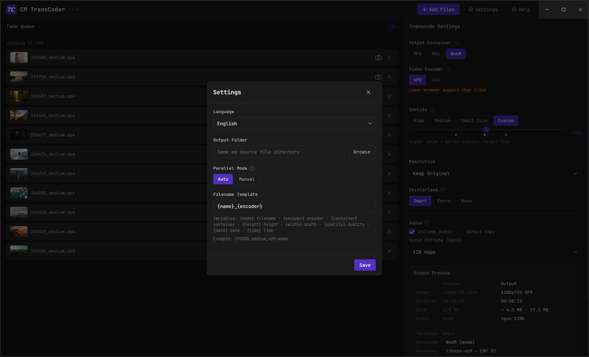
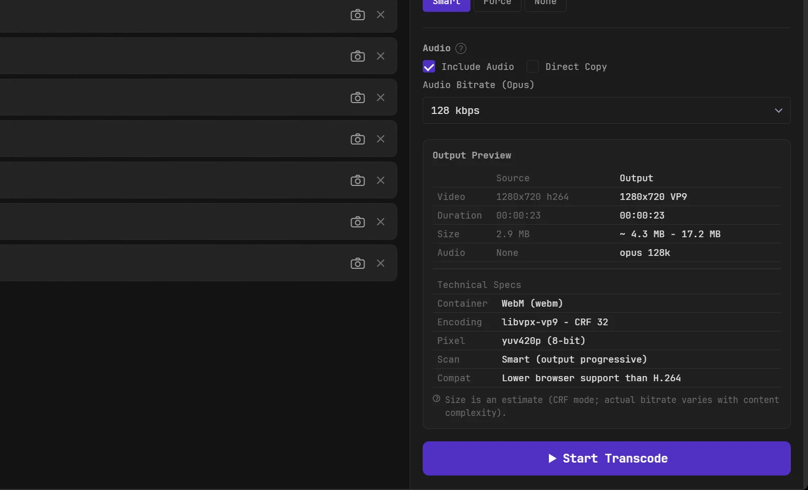
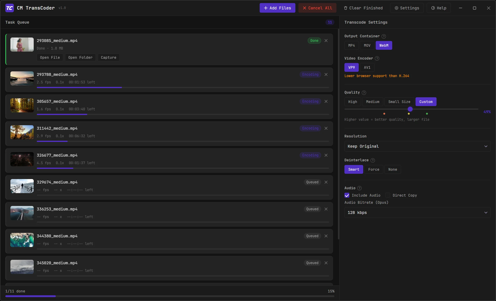

<div align="center">

# CM Video Transcoder

**Convert MP4 / MOV / MKV into videos that play smoothly in any browser**

Fine-grained control · Clean UI · Batch queue · Auto parallel · Hardware acceleration · Frame grab

[](LICENSE)
[]()
[]()

**English** · [中文](README.zh.md) · [日本語](README.ja.md) · [한국어](README.ko.md)

</div>

---

## Download & Install

| Channel | Notes |
|---------|-------|
| [**GitHub Releases**](../../releases) | Per-version installers and changelogs |

The installer **bundles FFmpeg — no extra setup required**. Install and start transcoding right away.

---

## ScreenShot





---

## About the Windows "Unknown Publisher" warning

This is free, open-source software and has not purchased a commercial code-signing certificate, so the first time you run the installer Windows may show a **blue SmartScreen prompt** or **"Unknown Publisher"**. This is normal for unsigned apps and **does not mean the software is unsafe**. To bypass:

1. On the blue prompt, click **More info**
2. Then click **Run anyway**

If you'd rather be safe about the source, download from [**GitHub Releases**](../../releases) and verify the file with the bundled `SHA256SUMS.txt`:

```powershell
# Run in the installer's folder; compare the output with the value in SHA256SUMS.txt
Get-FileHash .\CM-VideoTranscoder-1.0.0-setup.exe -Algorithm SHA256
```

> This is a fully local tool — it collects nothing and uploads nothing. The source is fully public; audit and build it yourself.

---

## Features

- **Input**: MP4 / MOV / MKV
- **Output container**: MP4 / MOV / WebM
- **Video codec**: H.264 / H.265 / VP9 / AV1
- **Hardware acceleration**: auto-detects NVIDIA NVENC / Intel QSV / AMD AMF — several times faster
- **Quality control**: High / Medium / Small-size presets, or a custom quality percentage (CRF)
- **Resolution**: presets or custom, with aspect-ratio lock, scale-to-fit, and black-bar padding
- **Deinterlace**: smart per-frame detection to guarantee progressive output and avoid Safari playback glitches
- **Audio**: AAC / Opus adaptive bitrate, or copy the original track as-is
- **Filename templates**: customize output names with variables like `{name} {encoder} {height} {date}`
- **Frame grab**: export a frame at any timestamp as PNG / WebP / JPG
- **Batch queue**: up to 100 files, auto-parallel by CPU core count, thumbnails, live progress, one-click open when done
- **Fully local**: collects and uploads nothing

## Quick start (development)

```bash
# 1. Clone
git clone https://github.com/complex-mission/video-transcoder.git
cd video-transcoder

# 2. Install dependencies
npm install

# 3. Add ffmpeg (binaries are not in the repo — see resources/README.md)
#    Download a Windows GPL build and put ffmpeg.exe / ffprobe.exe into resources/

# 4. Start
npm start
```

> `ffmpeg.exe` and `ffprobe.exe` are large GPLv3 binaries and are **not committed** to the repo.
> Download and place them in `resources/` per [`resources/README.md`](resources/README.md).

## Packaging

```bash
npm run dist        # build the NSIS installer (into dist/)
npm run dist:dir    # build the unpacked folder only (for debugging)
```

Output goes to `dist/`. Before packaging, make sure ffmpeg is in `resources/` (it gets bundled into the installer so users need no setup).

## Release

Build artifacts are not committed to git; they are distributed via GitHub Releases.

**One-click release (recommended)**:

```bash
# Bump "version" in package.json first, then:
npm run release              # auto-detects version, builds if needed, creates the GitHub release
npm run release -- --build   # force a rebuild before releasing
npm run release -- --notes "What's new..."   # custom release notes
```

Requires the [GitHub CLI](https://cli.github.com) installed and logged in (`gh auth login`).

**Manual release**:
1. `npm run dist` to produce `dist/CM-VideoTranscoder-<version>-setup.exe`
2. Repo page → Releases → New release, create a tag (e.g. `v1.0.0`)
3. Upload that setup.exe as an asset and publish

## Tech stack

Electron · vanilla HTML / CSS / JS (no front-end framework) · FFmpeg

## Project structure

```
src/
├── main/        main process: window, IPC, ffmpeg detection, transcode queue, probe/frame-grab
├── renderer/    renderer: UI and interaction
└── shared/      constants shared between main & renderer
resources/       icons, fonts (ffmpeg must be added manually)
```

## License

Open-sourced under [**GPL-3.0**](LICENSE).

- **FFmpeg**: the transcoding core, GPLv3 (incl. x264 / x265), © the [FFmpeg](https://ffmpeg.org) developers.
- **Fonts**: [JetBrains Mono](https://www.jetbrains.com/lp/mono/) (SIL OFL 1.1) and Xiaomi [MiSans](https://hyperos.mi.com/font/zh/) (free for commercial use).

Because it bundles GPLv3 FFmpeg, the distribution as a whole is under GPL-3.0.

---

<div align="center">

Built by [Complex Mission](https://tc.complexmission.com) · learn more at the [**official site**](https://tc.complexmission.com)

</div>
